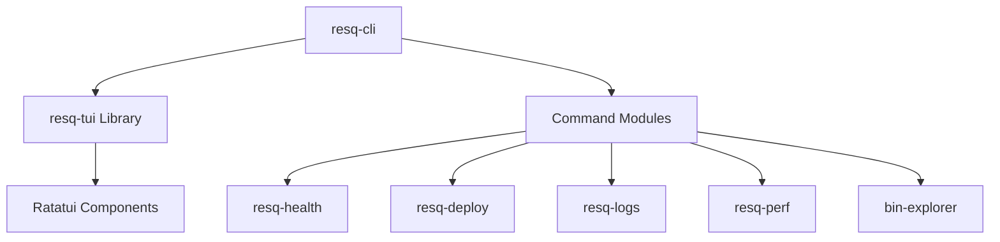

# resq CLI Documentation


---

## Table of Contents

- [Overview](#overview)
- [Features](#features)
- [Architecture](#architecture)
- [Quick Start](#quick-start)
- [Usage Examples](#usage-examples)
- [Configuration](#configuration)
- [API Overview](#api-overview)
- [Development](#development)
- [Contributing](#contributing)
- [Roadmap](#roadmap)
- [License](#license)

---

## Overview

`resq` is a high-performance Rust workspace providing a unified CLI and TUI toolchain for the ResQ autonomous drone platform. It is engineered to streamline developer workflows by consolidating auditing, security, performance monitoring, and deployment orchestration into a single, cohesive binary.

The project leverages [Ratatui](https://github.com/ratatui-org/ratatui) for rich terminal user interfaces, ensuring that complex operations—like service health diagnostics or binary analysis—remain readable and interactive.

---

## Features

*   **Security First:** Integrated secret scanning and repository auditing.
*   **Performance Monitoring:** Real-time metrics and flame graph generation for polyglot services.
*   **Orchestration:** TUI-based Kubernetes and Docker Compose deployment management.
*   **Developer Productivity:** Automated copyright header enforcement, tree-shaking, and `.gitignore`-aware workspace cleaning.
*   **Unified TUI Library:** Shared component library (`resq-tui`) ensuring consistent UX across the entire toolchain.

---

## Architecture

The project is structured as a Rust workspace to promote code reuse and modularity. Each domain-specific tool is encapsulated as its own crate.



---

## Quick Start

### Installation

**Via Cargo:**
```sh
cargo install resq-cli
```

**From Source:**
```sh
git clone https://github.com/resq-software/cli.git
cd cli
cargo build --release --workspace
```

### Basic Command Execution

Check copyright headers and run security scans to ensure workspace compliance:

```sh
# Ensure all files have the correct Apache-2.0 license headers
resq copyright --check

# Scan for accidentally committed secrets
resq secrets
```

---

## Usage Examples

### 1. Interactive Pre-commit Audit
Instead of manual checks, launch the interactive TUI audit tool:
```sh
resq pre-commit
```

### 2. Service Health Monitoring
Inspect service dependencies and health status in a real-time dashboard:
```sh
resq health
```

### 3. Binary Analysis
Analyze machine code and symbol exports for compiled binaries:
```sh
resq explore ./path/to/binary
```

---

## Configuration

| Environment Variable | Description |
| :--- | :--- |
| `GIT_HOOKS_SKIP` | Disables automated pre-commit hooks. |
| `RESQ_NIX_RECURSION` | Internal safety flag for recursive execution in Nix environments. |

Configuration for specific tools (e.g., health-checker) can often be found in `.env` files within the respective crate directories.

---

## API Overview

The `resq` CLI provides a sub-command-based interface:

- `resq audit`: Execute repository/blockchain event audits.
- `resq cost`: Calculate infrastructure/cloud resource consumption.
- `resq tree-shake`: Optimize module exports.
- `resq version`: Automate release versioning and change management.
- `resq deploy`: Launch the deployment orchestration dashboard.

---

## Development

The project utilizes `Nix` for reproducible development environments.

1. **Setup:** Run `./scripts/setup.sh` to configure local git hooks and install necessary dependencies.
2. **Environment:** Enter the shell with `nix develop`.
3. **Testing:** Execute `cargo nextest run` for optimized parallel testing.

### Git Hooks
The repository enforces strict quality standards via `.git-hooks/`. Ensure these are active by running the setup script provided in the root.

---

## Contributing

We strictly adhere to [Conventional Commits](https://www.conventionalcommits.org/).

1. **Fork** the repository.
2. **Feature Branch:** Create a branch following `feat/`, `fix/`, or `refactor/`.
3. **Commit:** Ensure your messages match the `type(scope): subject` format.
4. **Pull Request:** Link to relevant issues and ensure the CI pipeline (including `osv-scan` and `clippy`) passes.

See [`CONTRIBUTING.md`](./CONTRIBUTING.md) for detailed guidelines.

---

## Roadmap

- [ ] Support for custom plugin registration in `resq-cli`.
- [ ] Integration of remote Telemetry aggregation in `resq-perf`.
- [ ] Expanded support for cross-platform binary analysis (ARM/x86_64).
- [ ] Auto-fix capability for secret leaks.

---

## License

Copyright 2026 ResQ. Licensed under the [Apache License, Version 2.0](./LICENSE).