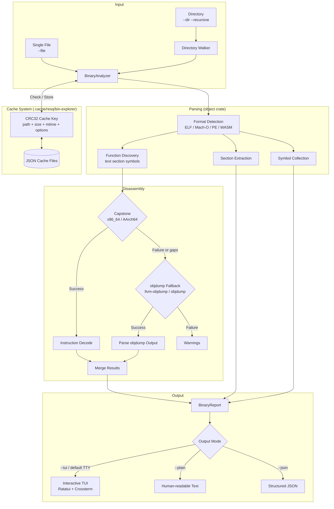

<!--
  Copyright 2026 ResQ

  Licensed under the Apache License, Version 2.0 (the "License");
  you may not use this file except in compliance with the License.
  You may obtain a copy of the License at

      http://www.apache.org/licenses/LICENSE-2.0

  Unless required by applicable law or agreed to in writing, software
  distributed under the License is distributed on an "AS IS" BASIS,
  WITHOUT WARRANTIES OR CONDITIONS OF ANY KIND, either express or implied.
  See the License for the specific language governing permissions and
  limitations under the License.
-->

# resq-bin

[](https://crates.io/crates/resq-bin)
[](LICENSE)

Binary and machine-code analyzer for the ResQ platform. Provides deep inspection of ELF, Mach-O, and PE object files with interactive TUI exploration, Capstone-powered disassembly with objdump fallback, symbol and section analysis, and a persistent CRC32-based cache for fast repeated analysis of large binaries.

## Capabilities

- **Multi-format binary parsing** -- ELF, Mach-O, PE, and WASM via the `object` crate.
- **Dual disassembly backends** -- Capstone for high-quality instruction decoding (x86_64, AArch64), with automatic fallback to `llvm-objdump`/`objdump` for missing functions.
- **Interactive TUI** -- Three-pane terminal interface (Targets, Functions, Disassembly) with regex search, function filtering, and keyboard navigation.
- **CLI output modes** -- Human-readable plain text and structured JSON for CI pipelines and tooling integration.
- **Smart caching** -- Persistent analysis cache keyed on file path, size, modification time, and analysis options. Falls back to CRC32 content hashing when mtime is unavailable.
- **Batch analysis** -- Recursive directory scanning with extension filtering for analyzing entire build output trees.
- **Read-only operation** -- Never mutates inspected binaries.

## Architecture



## Installation

```bash
# Build from the workspace root
cargo build --release -p resq-bin

# Binary is placed at:
# target/release/resq-bin

# Or install directly
cargo install --path resq-bin
```

### System Requirements

- **Rust**: Latest stable toolchain.
- **Capstone**: The `capstone` crate bundles its own copy; no system library required.
- **objdump** (optional): `llvm-objdump` or `objdump` on `PATH` enables the fallback disassembly backend. Analysis works without it, but some functions may lack disassembly when Capstone cannot decode them.

## CLI Reference

### Arguments

| Flag | Default | Description |
|------|---------|-------------|
| `--file <path>` | -- | Analyze a single binary file. Mutually exclusive with `--dir`. |
| `--dir <path>` | -- | Analyze all object-like files under a directory. Mutually exclusive with `--file`. |
| `--recursive` | `false` | Recurse into subdirectories when using `--dir`. |
| `--ext <suffix>` | -- | Filter files by suffix in `--dir` mode (e.g., `.so`, `.o`). |
| `--no-disasm` | `false` | Skip disassembly; collect only metadata (sections, symbols, entry point). |
| `--max-functions <n>` | `40` | Maximum number of functions to disassemble per binary. |
| `--config <path>` | `.resq-bin-explorer.toml` | Path to a TOML configuration file. |
| `--no-cache` | `false` | Disable the result cache entirely (no reads or writes). |
| `--rebuild-cache` | `false` | Ignore existing cache entries and re-analyze all targets. New results are still cached. |
| `--tui` | -- | Force interactive TUI mode. Mutually exclusive with `--json` and `--plain`. |
| `--plain` | `false` | Emit a human-readable non-interactive report. Mutually exclusive with `--json` and `--tui`. |
| `--json` | `false` | Emit a structured JSON report. Mutually exclusive with `--plain` and `--tui`. |

When none of `--tui`, `--plain`, or `--json` is specified, the output mode is determined automatically: TUI if stdout is a terminal, plain text otherwise.

## Usage Examples

### Single file -- interactive TUI (default on a terminal)

```bash
resq-bin --file target/release/resq
```

### Single file -- plain text report

```bash
resq-bin --file target/release/resq --plain
```

Output:

```
scan: total=1 processed=1 failed=0 cache_hits=0
== target/release/resq ==
format=Elf arch=X86_64 endian=Little size=4521984B entry=0x5040
sections=30 symbols=1842 functions=40
disasm_backend=capstone attempts=capstone: ok
coverage: total=40 with_insn=40 capstone=40 objdump=0 missing=0

  fn main @ 0x5040 size=128 insn=24
  fn _start @ 0x5000 size=47 insn=11
  ...
```

### Single file -- JSON output (for CI)

```bash
resq-bin --file target/release/resq --json | jq '.stats'
```

```json
{
  "total": 1,
  "processed": 1,
  "failed": 0,
  "cache_hits": 0
}
```

### Directory scan -- recursive with extension filter

```bash
resq-bin --dir target/release --recursive --ext .so --plain
```

### Batch analysis -- metadata only (fast)

```bash
resq-bin --dir target/release --recursive --no-disasm --json > report.json
```

### Force TUI with a non-default config

```bash
resq-bin --file my-service --tui --config my-config.toml
```

### Rebuild cache after recompilation

```bash
resq-bin --dir target/release --recursive --rebuild-cache --plain
```

## TUI Mode

The interactive TUI provides a three-pane layout for exploring binary analysis results.

### Layout

```
+-- resq-bin -----------------------------------------------------------+
| file: target/release/resq [ELF64 x86_64]                             |
+-----------------------------------------------------------------------+
| TARGETS            | FUNCTIONS              | Summary                 |
| resq [Elf X86_64]  | main [0x5040] insn=24  | file: target/release/.. |
| resq-bin [Elf ..] | _start [0x5000] insn=11| format=Elf arch=X86_64  |
|                    |                        +-------------------------+
|                    |                        | Disassembly             |
|                    |                        | 0x5040  push rbp        |
|                    |                        | 0x5041  mov rbp, rsp    |
+-----------------------------------------------------------------------+
| Q Quit | Tab Focus | / Fn Filter | ? Regex | N Jump | H Help | Normal|
+-----------------------------------------------------------------------+
```

### Keyboard Shortcuts

| Key | Action |
|-----|--------|
| `q` / `Esc` | Quit the TUI |
| `Tab` | Cycle focus forward: Targets -> Functions -> Disassembly |
| `Shift+Tab` | Cycle focus backward |
| `Left` / `Right` | Switch focus between panes |
| `Up` / `k` | Navigate up in the focused pane |
| `Down` / `j` | Navigate down in the focused pane |
| `Page Up` | Scroll disassembly up by 12 lines |
| `Page Down` | Scroll disassembly down by 12 lines |
| `Home` | Scroll disassembly to top |
| `/` | Open function substring filter dialog |
| `?` | Open disassembly regex search dialog (case-insensitive) |
| `c` | Clear the active function filter |
| `n` | Jump to next match (function filter or disassembly regex) |
| `N` | Jump to previous match |
| `h` | Toggle help overlay |

## Cache System

resq-bin maintains a persistent cache of analysis results to avoid redundant heavy disassembly work on unchanged binaries.

### Cache Location

The default cache directory is `.cache/resq/bin-explorer` relative to the working directory. This can be overridden with the `cache_dir` key in the configuration file.

### Cache Key Computation

Each cache entry is keyed by a CRC32 hash of a fingerprint string that includes:

1. **Protocol version** (`v5`) -- cache is automatically invalidated on schema changes.
2. **Canonical file path** -- absolute path to the binary.
3. **File size** -- byte length from filesystem metadata.
4. **Analysis options** -- disassembly enabled/disabled, max functions, max symbols, max instructions per function.
5. **Modification time** -- nanosecond-precision mtime when available.
6. **Content CRC32** -- full file content hash as a fallback when mtime is unavailable (e.g., some network filesystems).

### Cache Behavior

| Scenario | Behavior |
|----------|----------|
| Default | Read from cache on hit; write new entries after analysis. |
| `--no-cache` | Bypass cache entirely. No reads, no writes. |
| `--rebuild-cache` | Ignore existing entries but write fresh results. |
| Binary recompiled | Cache miss (mtime or size changed); automatic re-analysis. |
| Options changed | Cache miss (different max_functions, disasm toggle, etc.). |

### Cache Storage Format

Each entry is stored as a JSON file named `{crc32_hex}.json` containing the full `BinaryReport` structure.

## Configuration File

resq-bin reads an optional TOML configuration file. By default it looks for `.resq-bin-explorer.toml` in the current directory, or you can specify a path with `--config`.

### Format

```toml
# All fields are optional. CLI flags override config values.

# Recurse into subdirectories in --dir mode
recursive = true

# Filter files by extension
ext = ".so"

# Disable disassembly (metadata only)
no_disasm = false

# Maximum functions to disassemble per binary
max_functions = 60

# Output mode: "tui", "plain", or "json"
output = "tui"

# Disable cache
no_cache = false

# Force cache rebuild
rebuild_cache = false

# Custom cache directory
cache_dir = "/tmp/resq-cache"
```

CLI flags always take precedence over configuration file values.

## JSON Output Format

The `--json` flag emits a single JSON object with three top-level fields:

```json
{
  "stats": {
    "total": 5,
    "processed": 4,
    "failed": 1,
    "cache_hits": 2
  },
  "reports": [
    {
      "path": "target/release/resq",
      "format": "Elf",
      "architecture": "X86_64",
      "endianness": "Little",
      "entry": 20544,
      "size_bytes": 4521984,
      "sections": [
        { "name": ".text", "address": 4096, "size": 1048576, "kind": "Text" }
      ],
      "symbols": [
        { "name": "main", "address": 20544, "size": 128, "kind": "Text", "is_global": true }
      ],
      "functions": [
        {
          "name": "main",
          "address": 20544,
          "size": 128,
          "instructions": [
            { "address": 20544, "text": "push rbp" },
            { "address": 20545, "text": "mov rbp, rsp" }
          ]
        }
      ],
      "disassembly_backend": "capstone",
      "disassembly_attempts": ["capstone: ok"],
      "disassembly_coverage": {
        "total_functions": 40,
        "functions_with_instructions": 40,
        "capstone_functions": 40,
        "objdump_functions": 0,
        "missing_functions": 0
      },
      "function_backend_coverage": [
        { "name": "main", "backend": "capstone", "instruction_count": 24 }
      ],
      "warnings": []
    }
  ],
  "issues": [
    { "path": "target/release/build-script", "error": "failed to parse object file" }
  ]
}
```

### Field Reference

| Field | Type | Description |
|-------|------|-------------|
| `stats.total` | integer | Number of files considered for analysis. |
| `stats.processed` | integer | Number of files successfully analyzed. |
| `stats.failed` | integer | Number of files that produced errors. |
| `stats.cache_hits` | integer | Number of results served from cache. |
| `reports[].format` | string | Object file format (`Elf`, `Pe`, `MachO`, `Wasm`). |
| `reports[].architecture` | string | CPU architecture (`X86_64`, `Aarch64`, etc.). |
| `reports[].entry` | integer | Entrypoint virtual address. |
| `reports[].disassembly_backend` | string or null | Backend used: `capstone`, `objdump`, `capstone+objdump`, or null. |
| `reports[].disassembly_coverage` | object or null | Counts of functions decoded by each backend. |
| `issues[].path` | string | Path to the file that failed analysis. |
| `issues[].error` | string | Error message describing the failure. |

## Source Layout

```
resq-bin/
  src/
    main.rs              CLI entry point, argument parsing, mode selection
    lib.rs               Library root (re-exports analysis module)
    tui.rs               Interactive TUI (Ratatui + Crossterm)
    cache.rs             CRC32-based persistent cache system
    analysis/
      mod.rs             BinaryAnalyzer, Capstone/objdump backends, report types
  Cargo.toml             Crate manifest
```

## License

Licensed under the Apache License, Version 2.0. See [LICENSE](http://www.apache.org/licenses/LICENSE-2.0) for details.
