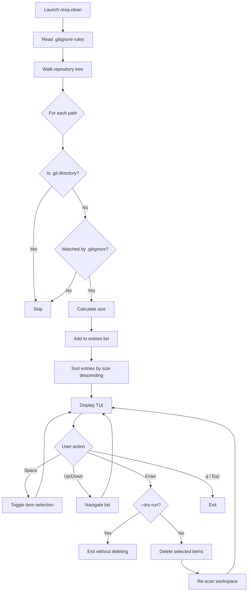

<!--
  Copyright 2026 ResQ

  Licensed under the Apache License, Version 2.0 (the "License");
  you may not use this file except in compliance with the License.
  You may obtain a copy of the License at

      http://www.apache.org/licenses/LICENSE-2.0

  Unless required by applicable law or agreed to in writing, software
  distributed under the License is distributed on an "AS IS" BASIS,
  WITHOUT WARRANTIES OR CONDITIONS OF ANY KIND, either express or implied.
  See the License for the specific language governing permissions and
  limitations under the License.
-->

# resq-clean

[](https://crates.io/crates/resq-clean)
[](LICENSE)

Interactive, `.gitignore`-aware workspace cleaner for ResQ development. Provides a TUI that scans for build artifacts and gitignored files, lets you select what to remove, and reclaims disk space safely.

## Overview

`resq-clean` walks the repository tree, applies `.gitignore` rules via the `ignore` crate (supporting negated patterns and nested `.gitignore` files), and presents every gitignored entry in an interactive list sorted by size. You can toggle individual items on or off before confirming deletion.

## Cleanup Decision Tree



## Installation

```bash
# From the workspace root
cargo build --release -p resq-clean

# Binary location
target/release/resq-clean
```

## CLI Arguments

| Flag | Default | Description |
|------|---------|-------------|
| `--dry-run` | `false` | Preview what would be deleted without removing anything. Pressing `Enter` in the TUI exits instead of deleting. |

## Usage Examples

### Interactive TUI (default)

```bash
# Launch the cleanup TUI in the current directory
resq-clean
```

The TUI displays all gitignored files and directories sorted by size, with checkboxes. All items are selected by default.

### Dry Run

```bash
# Preview mode -- nothing is deleted
resq-clean --dry-run
```

In dry-run mode, pressing `Enter` exits the TUI without performing any deletions, letting you inspect what would be removed.

### Targeted Cleanup

```bash
# Run from a specific subdirectory
cd services/infrastructure-api && resq-clean
```

The scanner uses the current working directory as its root, so you can scope cleanup to a single service or library.

## TUI Keybindings

| Key | Action |
|-----|--------|
| `q` / `Esc` | Quit without deleting |
| `Space` | Toggle selection on the highlighted item |
| `Enter` | Delete all selected items (or exit in `--dry-run` mode) |
| `Up` / `k` | Move selection up |
| `Down` / `j` | Move selection down |

## What Gets Deleted

Anything matched by `.gitignore` rules, which typically includes:

| Pattern | Description |
|---------|-------------|
| `target/` | Rust build output |
| `node_modules/` | npm/bun dependencies |
| `.next/` | Next.js build cache |
| `dist/` | TypeScript/Bun build output |
| `build/` | CMake build directories |
| `__pycache__/` | Python bytecode cache |
| `*.pyc` | Compiled Python files |
| `.pytest_cache/` | Pytest cache |
| `*.o`, `*.a`, `*.so` | C/C++ object files and libraries |
| `*.nettrace` | .NET profiling traces |
| `flamegraph.svg` | Generated flame graph profiles |

Files matching negated gitignore entries (e.g., `!dist/keep-this.json`) are preserved automatically.

## Environment Variables

No environment variables are required. The tool operates entirely on the local filesystem using the current working directory as its root.

## Output Format

The TUI header displays the total size of all currently selected items (e.g., `PENDING: 2.4 GB`). Each entry in the list shows:

```
[x] <icon> <relative-path>                      <size>
```

- `[x]` / `[ ]` -- selection checkbox
- Icon -- folder or file indicator
- Relative path -- path relative to the scan root
- Size -- human-readable size (B, KB, MB, GB)

After deletion, the workspace is re-scanned and the list refreshes to reflect the current state.

## Safety Notes

- **Dry-run first**: Always use `--dry-run` on the first pass to review what will be removed.
- **Gitignore-only**: Only files and directories matched by `.gitignore` rules are candidates for deletion. Tracked files are never touched.
- **Negated patterns respected**: Entries matching negated patterns (e.g., `!important.log`) are excluded from the scan.
- **No .git deletion**: The `.git` directory and its contents are unconditionally skipped.
- **Interactive confirmation**: Nothing is deleted until you press `Enter` in the TUI. You can deselect individual items with `Space` before confirming.
- **Re-scan after deletion**: After deleting, the tool re-scans to show the updated state, so you can verify the results.
- **Directories removed recursively**: Selected directories are removed with `remove_dir_all`. Ensure you have deselected anything you want to keep.

## When to Use

- Before committing, to ensure no build artifacts slip through
- After switching branches, to avoid stale build caches
- Periodic deep clean when disk space is low

For ecosystem-specific cleanup without the TUI:

```bash
cargo clean                                              # Rust only
rm -rf services/coordination-hce/node_modules            # Node only
find . -type d -name __pycache__ -exec rm -rf {} +       # Python only
```

## License

Licensed under the Apache License, Version 2.0. See [LICENSE](../../LICENSE) for details.
