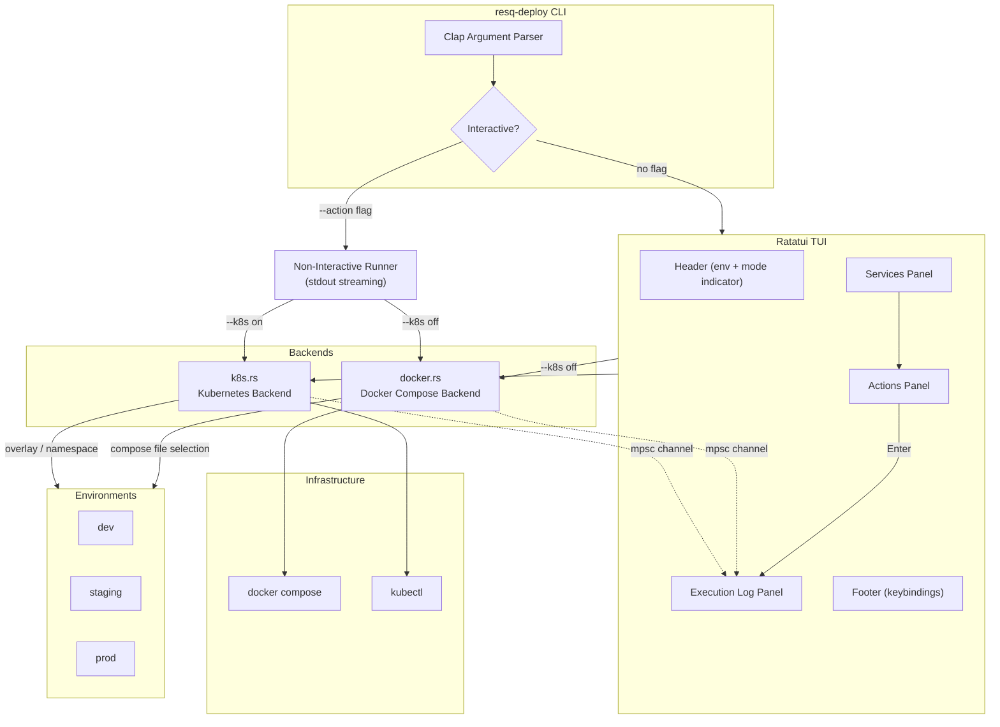

<!--
  Copyright 2026 ResQ

  Licensed under the Apache License, Version 2.0 (the "License");
  you may not use this file except in compliance with the License.
  You may obtain a copy of the License at

      http://www.apache.org/licenses/LICENSE-2.0

  Unless required by applicable law or agreed to in writing, software
  distributed under the License is distributed on an "AS IS" BASIS,
  WITHOUT WARRANTIES OR CONDITIONS OF ANY KIND, either express or implied.
  See the License for the specific language governing permissions and
  limitations under the License.
-->

# resq-deploy

[](https://crates.io/crates/resq-deploy)
[](LICENSE)

Interactive deployment manager for ResQ environments. Provides a three-panel Ratatui TUI for managing Docker Compose and Kubernetes deployments across dev, staging, and production, plus a non-interactive `--action` flag for CI/CD pipelines and scripting.

## Overview

`resq-deploy` wraps `docker compose` and `kubectl` behind a unified interface. Operators select a target environment and service, pick an action, and watch real-time execution output -- all without leaving the terminal. For automation, every action is accessible via a single CLI invocation that streams output to stdout and exits with the process status code.

## Architecture



## Installation

```bash
# From the workspace root
cargo install --path crates/resq-deploy

# Or build locally
cargo build --release -p resq-deploy
# Binary: target/release/resq-deploy
```

## CLI Arguments

| Flag | Short | Default | Description |
|------|-------|---------|-------------|
| `--env <ENV>` | | `dev` | Target environment: `dev`, `staging`, or `prod` |
| `--service <NAME>` | | all | Scope action to a single service |
| `--k8s` | | off | Use Kubernetes backend instead of Docker Compose |
| `--action <ACTION>` | | -- | Run a single action non-interactively and exit |

## Usage Examples

### Interactive TUI (default)

```bash
# Launch with defaults (dev environment, Docker Compose)
resq-deploy

# Target staging environment
resq-deploy --env staging

# Kubernetes mode against production
resq-deploy --k8s --env prod
```

### Non-Interactive / CI Mode

```bash
# Bring up the dev stack
resq-deploy --env dev --action up

# Deploy to production via Kubernetes
resq-deploy --env prod --k8s --action deploy

# Restart a single service
resq-deploy --env dev --service infrastructure-api --action restart

# Tear down staging
resq-deploy --env staging --action down

# View logs for a specific service
resq-deploy --env dev --service coordination-hce --action logs
```

### CI Pipeline Example

```bash
# Build, deploy, and gate on health
resq-deploy --env dev --action up
resq-health --check || { echo "Services not ready"; exit 1; }

# Production Kubernetes deploy
resq-deploy --env prod --k8s --action deploy
```

## TUI Layout

```
+-- Services ----------+-- Actions ----------+-- Execution Log ----------------+
|                      |                     |                                 |
| > infrastructure-api |   > status          | [14:22:01] Starting up...       |
|   coordination-hce   |     build           | [14:22:02] infra-api OK         |
|   intelligence-pdie  |     up              | [14:22:03] coord-hce OK         |
|   web-dashboard      |     down            | [14:22:04] All services up      |
|                      |     restart         |                                 |
|                      |     logs            |                                 |
+----------------------+---------------------+---------------------------------+
| ENV: DEV   [E] cycle env   [Tab] focus   [Up/Down] select   [Enter] run     |
| [Q] quit                                                                     |
+------------------------------------------------------------------------------+
```

## Keyboard Shortcuts

| Key | Action |
|-----|--------|
| `q` / `Esc` | Quit |
| `Tab` | Cycle focus between Services and Actions panels |
| `Up` / `k` | Move selection up in focused panel |
| `Down` / `j` | Move selection down in focused panel |
| `Enter` | Execute the selected action on the selected service |
| `e` | Cycle environment: dev -> staging -> prod -> dev |

## Docker Compose Actions

| Action | Description | Underlying Command |
|--------|-------------|--------------------|
| `status` | Show container status for all services | `docker compose ps --format json` |
| `build` | Build images for one or all services | `docker compose build [service]` |
| `up` | Start services in detached mode with build | `docker compose up -d --build [service]` |
| `down` | Stop and remove all containers | `docker compose down` |
| `restart` | Restart one or all services | `docker compose restart [service]` |
| `logs` | Tail last 100 log lines (streaming) | `docker compose logs -f --tail 100 [service]` |

## Kubernetes Actions

| Action | Description | Underlying Command |
|--------|-------------|--------------------|
| `status` | List pods in the environment namespace | `kubectl get pods -n resq-<env> -o wide` |
| `deploy` | Apply Kustomize overlay for the environment | `kubectl apply -k infra/k8s/overlays/<env>` |
| `destroy` | Delete resources from overlay (safe ignore) | `kubectl delete -k infra/k8s/overlays/<env> --ignore-not-found` |
| `logs` | Stream logs from a specific deployment | `kubectl logs -f deployment/<service> -n resq-<env>` |

## Managed Services

The following services are tracked by default:

| Service | Description |
|---------|-------------|
| `infrastructure-api` | Core platform API |
| `coordination-hce` | Coordination engine |
| `intelligence-pdie` | Intelligence/ML engine |
| `web-dashboard` | Frontend web application |

## Environment Configuration

| Environment | Docker Compose Files | K8s Overlay Path |
|-------------|---------------------|------------------|
| `dev` | `docker-compose.yml` + `docker-compose.dev.yml` | `infra/k8s/overlays/dev` |
| `staging` | `docker-compose.yml` (base only) | `infra/k8s/overlays/staging` |
| `prod` | `docker-compose.yml` + `docker-compose.prod.yml` | `infra/k8s/overlays/prod` |

Docker Compose files are resolved relative to `<project_root>/infra/docker/`. Kubernetes overlays are resolved relative to `<project_root>/infra/k8s/overlays/<env>`. The project root is auto-detected by ascending two directory levels from the current working directory.

## Environment Variables

`resq-deploy` does not currently read environment variables for configuration. All settings are controlled via CLI flags. Docker and kubectl inherit the calling shell's environment (e.g., `DOCKER_HOST`, `KUBECONFIG`).

## Dependencies

| Crate | Purpose |
|-------|---------|
| `resq-tui` | Shared TUI components, theme, header/footer widgets |
| `clap` | CLI argument parsing (derive mode) |
| `tokio` | Async runtime for background task management |
| `serde` / `serde_json` | JSON deserialization of `docker compose ps` output |
| `chrono` | Timestamp handling |
| `anyhow` | Error propagation |

## License

Licensed under the Apache License, Version 2.0. See [LICENSE](../../LICENSE) for details.
