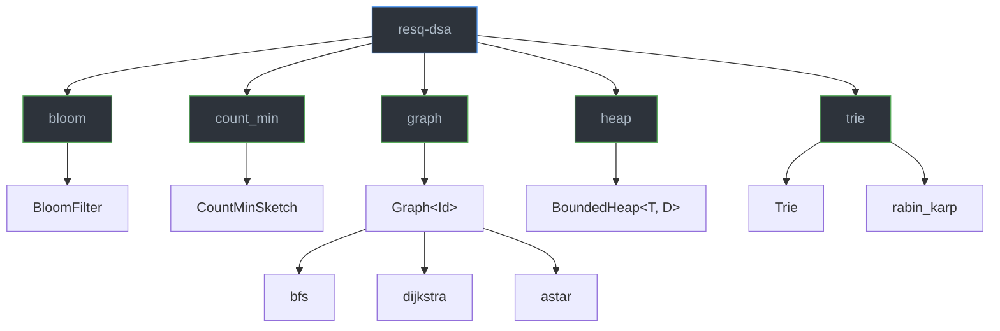
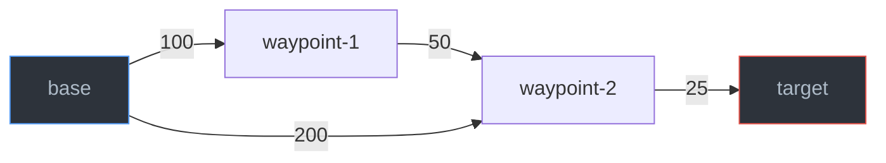

# resq-dsa

[](https://crates.io/crates/resq-dsa)
[](https://docs.rs/resq-dsa)
[](https://github.com/wombocombo/wrk/blob/master/LICENSE)

Production-grade data structures and algorithms with **zero external dependencies**. Designed for `no_std` environments and embedded systems while remaining ergonomic in standard Rust applications. The crate provides space-efficient probabilistic data structures (Bloom filter, Count-Min sketch), graph algorithms (BFS, Dijkstra, A\*), a bounded heap for K-nearest-neighbor tracking, a trie for prefix-based search, and Rabin-Karp rolling-hash string matching.

## Module Structure



## Feature Flags

| Feature | Default | Description |
|---------|---------|-------------|
| `std`   | Yes     | Enables standard library support. Disable for `no_std` environments (the crate uses `alloc` internally). |

## Installation

### With `std` (default)

```toml
[dependencies]
resq-dsa = "0.1"
```

### `no_std` environments

```toml
[dependencies]
resq-dsa = { version = "0.1", default-features = false }
```

When `std` is disabled the crate compiles with `#![no_std]` and relies only on `alloc`. You must provide a global allocator in your binary.

---

## Data Structures

### Bloom Filter

A space-efficient probabilistic set-membership data structure. It can tell you if an element is **possibly** in the set or **definitely not** in the set. False positives are possible; false negatives are not.

The filter uses `k` independent FNV-1a hash functions (seeded variants) to set bits in an `m`-bit array. Optimal values for `k` and `m` are computed automatically from the desired capacity and false-positive rate.

#### Complexity

| Operation | Time   | Space |
|-----------|--------|-------|
| `new`     | O(m)   | O(m)  |
| `add`     | O(k)   | --    |
| `has`     | O(k)   | --    |
| `len`     | O(1)   | --    |
| `is_empty`| O(1)   | --    |
| `clear`   | O(m)   | --    |

Where **m** is the bit-array size and **k** is the number of hash functions (both derived from `capacity` and `error_rate`).

#### API Reference

| Method | Signature | Description |
|--------|-----------|-------------|
| `new` | `fn new(capacity: usize, error_rate: f64) -> Self` | Creates a new Bloom filter sized for `capacity` elements at the given false-positive `error_rate` (must be in `(0, 1)`). Panics if `error_rate` is out of range or `capacity` is zero. |
| `add` | `fn add(&mut self, item: impl AsRef<[u8]>)` | Adds an element to the filter. Accepts `&str`, `String`, `&[u8]`, `Vec<u8>`, etc. |
| `has` | `fn has(&self, item: impl AsRef<[u8]>) -> bool` | Returns `true` if the element is possibly in the set, `false` if it is definitely absent. |
| `len` | `const fn len(&self) -> usize` | Returns the number of elements that have been added. |
| `is_empty` | `const fn is_empty(&self) -> bool` | Returns `true` if no elements have been added. |
| `clear` | `fn clear(&mut self)` | Resets the filter, removing all elements. |

#### Example

```rust
use resq_dsa::bloom::BloomFilter;

// Create a filter for 10,000 items with a 1% false-positive rate
let mut bf = BloomFilter::new(10_000, 0.01);

bf.add("drone-001");
bf.add("drone-002");
bf.add(b"raw-bytes" as &[u8]);

assert!(bf.has("drone-001"));   // definitely present
assert!(!bf.has("drone-999"));  // definitely absent
assert_eq!(bf.len(), 3);

bf.clear();
assert!(bf.is_empty());
assert!(!bf.has("drone-001"));  // cleared
```

---

### Count-Min Sketch

A space-efficient probabilistic data structure for **frequency estimation**. It may overcount but never undercounts. Estimates are within `epsilon * N` of the true count with probability `1 - delta`, where `N` is the total count of all increments.

Uses `depth` independent FNV-1a hash functions mapping elements to `width` columns. The estimated count for a key is the **minimum** across all rows.

#### Complexity

| Operation   | Time     | Space          |
|-------------|----------|----------------|
| `new`       | O(w * d) | O(w * d)       |
| `increment` | O(d)     | --             |
| `estimate`  | O(d)     | --             |

Where **w** = `ceil(e / epsilon)` (width) and **d** = `ceil(ln(1 / delta))` (depth).

#### API Reference

| Method | Signature | Description |
|--------|-----------|-------------|
| `new` | `fn new(epsilon: f64, delta: f64) -> Self` | Creates a new sketch. `epsilon` controls error magnitude, `delta` controls failure probability. Both must be in `(0, 1)`. |
| `increment` | `fn increment(&mut self, key: impl AsRef<[u8]>, count: u64)` | Increments the count for `key` by `count`. Counts are stored as `u64` and saturate on overflow. |
| `estimate` | `fn estimate(&self, key: impl AsRef<[u8]>) -> u64` | Returns the estimated count for `key`. Guaranteed to be >= the true count. |

#### Example

```rust
use resq_dsa::count_min::CountMinSketch;

// Estimates within 1% of true count, 99% of the time
let mut cms = CountMinSketch::new(0.01, 0.01);

cms.increment("sensor-temp-high", 5);
cms.increment("sensor-temp-high", 3);
cms.increment("sensor-humidity", 1);

let temp_count = cms.estimate("sensor-temp-high");
assert!(temp_count >= 8); // never undercounts

// Works with byte slices
cms.increment(b"raw-key" as &[u8], 10);
assert!(cms.estimate(b"raw-key" as &[u8]) >= 10);

// Unknown keys return 0
assert_eq!(cms.estimate("never-seen"), 0);
```

---

### Graph (Weighted Directed)

A weighted directed graph with three pathfinding algorithms: breadth-first search (BFS), Dijkstra's shortest path, and A\* with a user-provided heuristic.

Node identifiers can be any type that implements `Eq + Hash + Clone` (and additionally `Ord` for Dijkstra and A\*). Edge weights are `u64`.



#### Complexity

| Operation  | Time                  | Space        |
|------------|-----------------------|--------------|
| `new`      | O(1)                  | O(1)         |
| `add_edge` | O(1) amortized        | O(1)         |
| `bfs`      | O(V + E)              | O(V)         |
| `dijkstra` | O((V + E) log V)      | O(V)         |
| `astar`    | O((V + E) log V) *    | O(V)         |

\* A\* worst case matches Dijkstra; with a good heuristic it explores fewer nodes.

#### API Reference

| Method | Signature | Description |
|--------|-----------|-------------|
| `new` | `fn new() -> Self` | Creates a new empty directed graph. Also implements `Default`. |
| `add_edge` | `fn add_edge(&mut self, from: Id, to: Id, weight: u64)` | Adds a directed edge. For undirected graphs, call twice with reversed nodes. |
| `bfs` | `fn bfs(&self, start: &Id) -> Vec<Id>` | Returns all reachable nodes from `start` in breadth-first order. Requires `Id: Eq + Hash + Clone`. |
| `dijkstra` | `fn dijkstra(&self, start: &Id, end: &Id) -> Option<(Vec<Id>, u64)>` | Finds the shortest path and its cost. Returns `None` if `end` is unreachable. Requires `Id: Eq + Hash + Clone + Ord`. |
| `astar` | `fn astar<H: Fn(&Id, &Id) -> u64>(&self, start: &Id, end: &Id, h: H) -> Option<(Vec<Id>, u64)>` | A\* shortest path with heuristic `h(node, goal)`. The heuristic must be admissible and consistent for correct results. Requires `Id: Eq + Hash + Clone + Ord`. |

#### Examples

```rust
use resq_dsa::graph::Graph;

let mut g = Graph::<&str>::new();

// Build the graph
g.add_edge("base", "waypoint-1", 100);
g.add_edge("waypoint-1", "waypoint-2", 50);
g.add_edge("base", "waypoint-2", 200);
g.add_edge("waypoint-2", "target", 25);

// BFS -- visit all reachable nodes
let visited = g.bfs(&"base");
assert!(visited.contains(&"target"));

// Dijkstra -- find shortest path
let (path, cost) = g.dijkstra(&"base", &"target").unwrap();
assert_eq!(path, vec!["base", "waypoint-1", "waypoint-2", "target"]);
assert_eq!(cost, 175);

// Unreachable nodes return None
assert!(g.dijkstra(&"target", &"base").is_none());
```

**A\* with a heuristic:**

```rust
use resq_dsa::graph::Graph;

let mut g = Graph::<u64>::new();
g.add_edge(0, 1, 1);
g.add_edge(1, 2, 1);
g.add_edge(0, 3, 10);
g.add_edge(3, 2, 1);

// Use absolute difference as heuristic
let (path, cost) = g.astar(&0, &2, |a, b| a.abs_diff(*b)).unwrap();
assert_eq!(path, vec![0, 1, 2]);
assert_eq!(cost, 2);
```

---

### Bounded Heap

A bounded max-heap that retains only the **K entries with the smallest distance values**. Useful for K-nearest-neighbor search, top-K tracking, and streaming scenarios where you want to keep only the closest results.

The root always holds the entry with the **largest** distance among the retained items. When the heap is full and a new entry has a smaller distance than the root, the root is evicted.

#### Complexity

| Operation   | Time      | Space |
|-------------|-----------|-------|
| `new`       | O(1)      | O(k)  |
| `insert`    | O(log k)  | --    |
| `peek`      | O(1)      | --    |
| `to_sorted` | O(k log k)| O(k)  |
| `len`       | O(1)      | --    |
| `is_empty`  | O(1)      | --    |

Where **k** is the heap limit.

#### API Reference

| Method | Signature | Description |
|--------|-----------|-------------|
| `new` | `fn new(limit: usize, dist: D) -> Self` | Creates a heap that keeps at most `limit` items, ordered by the distance function `dist: Fn(&T) -> f64`. |
| `insert` | `fn insert(&mut self, entry: T)` | Inserts an entry. If full and the new entry's distance is less than the current max, the max is evicted. Otherwise the entry is rejected. |
| `peek` | `fn peek(&self) -> Option<&T>` | Returns a reference to the entry with the maximum distance (the root), or `None` if empty. |
| `to_sorted` | `fn to_sorted(&self) -> Vec<&T>` | Returns all entries sorted by distance ascending (nearest first). Allocates a new `Vec` on each call. |
| `len` | `const fn len(&self) -> usize` | Returns the current number of entries. |
| `is_empty` | `const fn is_empty(&self) -> bool` | Returns `true` if the heap is empty. |

#### Example

```rust
use resq_dsa::heap::BoundedHeap;

#[derive(Debug)]
struct Waypoint { id: u32, distance: f64 }

// Keep the 3 nearest waypoints
let mut h = BoundedHeap::new(3, |w: &Waypoint| w.distance);

h.insert(Waypoint { id: 1, distance: 10.0 });
h.insert(Waypoint { id: 2, distance: 2.0 });
h.insert(Waypoint { id: 3, distance: 7.0 });
h.insert(Waypoint { id: 4, distance: 1.0 });  // evicts id=1 (distance 10.0)
h.insert(Waypoint { id: 5, distance: 50.0 }); // rejected (too far)

assert_eq!(h.len(), 3);

// peek returns the current max (the eviction threshold)
assert_eq!(h.peek().unwrap().id, 3); // id=3 has distance 7.0

// Sorted nearest-first
let sorted: Vec<u32> = h.to_sorted().iter().map(|w| w.id).collect();
assert_eq!(sorted, vec![4, 2, 3]);
```

**Works with closures:**

```rust
use resq_dsa::heap::BoundedHeap;

let offset = 1.0;
let mut h = BoundedHeap::new(5, move |x: &f64| *x + offset);
h.insert(3.0);
h.insert(1.0);
assert_eq!(h.len(), 2);
```

---

### Trie (Prefix Tree)

A prefix tree for efficient string storage, exact lookup, and prefix-based autocomplete. All operations run in O(m) time where m is the length of the input string.

Internally, each node stores a `HashMap<char, TrieNode>`, making the trie Unicode-aware.

#### Complexity

| Operation     | Time | Space           |
|---------------|------|-----------------|
| `new`         | O(1) | O(1)            |
| `insert`      | O(m) | O(m) worst case |
| `search`      | O(m) | --              |
| `starts_with` | O(m + r) | O(r)        |

Where **m** is the string length and **r** is the total length of all matching results.

#### API Reference

| Method | Signature | Description |
|--------|-----------|-------------|
| `new` | `fn new() -> Self` | Creates a new empty trie. Also implements `Default`. |
| `insert` | `fn insert(&mut self, word: &str)` | Inserts a word into the trie. |
| `search` | `fn search(&self, word: &str) -> bool` | Returns `true` if the exact word exists in the trie. |
| `starts_with` | `fn starts_with(&self, prefix: &str) -> Vec<String>` | Returns all words that start with the given prefix. Uses DFS with a shared buffer to minimize allocations. |

#### Example

```rust
use resq_dsa::trie::Trie;

let mut t = Trie::new();
t.insert("drone");
t.insert("drone-001");
t.insert("drone-002");
t.insert("deploy");

// Exact search
assert!(t.search("drone"));
assert!(!t.search("dro")); // prefix alone is not a word

// Autocomplete
let mut suggestions = t.starts_with("drone-");
suggestions.sort();
assert_eq!(suggestions, vec!["drone-001", "drone-002"]);

// All words starting with "d"
let mut all_d = t.starts_with("d");
all_d.sort();
assert_eq!(all_d, vec!["deploy", "drone", "drone-001", "drone-002"]);
```

---

### Rabin-Karp String Search

A rolling-hash string matching algorithm that finds all occurrences of a pattern in a text. Uses a polynomial rolling hash with modular arithmetic (base 31, mod 10^9 + 7).

The algorithm is **Unicode-aware** -- it operates on `char` boundaries, so multi-byte characters are handled correctly. Indices in the result are character positions, not byte offsets.

#### Complexity

| Case    | Time       | Space |
|---------|------------|-------|
| Average | O(n + m)   | O(m)  |
| Worst   | O(n * m)   | O(m)  |

Where **n** is the text length and **m** is the pattern length (both in chars).

#### API Reference

| Function | Signature | Description |
|----------|-----------|-------------|
| `rabin_karp` | `fn rabin_karp(text: &str, pattern: &str) -> Vec<usize>` | Returns a vector of starting character indices where `pattern` occurs in `text`. Returns an empty vector if there are no matches or the pattern is empty. |

#### Example

```rust
use resq_dsa::trie::rabin_karp;

// Multiple overlapping matches
let matches = rabin_karp("ababab", "ab");
assert_eq!(matches, vec![0, 2, 4]);

// Single match
let single = rabin_karp("hello world", "world");
assert_eq!(single, vec![6]);

// No match
let none = rabin_karp("hello", "xyz");
assert!(none.is_empty());

// Unicode support
let unicode = rabin_karp("cafe\u{0301} cafe\u{0301}", "cafe\u{0301}");
assert_eq!(unicode, vec![0, 6]);
```

---

## Quick Reference

| Module | Primary Type | Key Methods |
|--------|-------------|-------------|
| `bloom` | `BloomFilter` | `new`, `add`, `has`, `len`, `is_empty`, `clear` |
| `count_min` | `CountMinSketch` | `new`, `increment`, `estimate` |
| `graph` | `Graph<Id>` | `new`, `add_edge`, `bfs`, `dijkstra`, `astar` |
| `heap` | `BoundedHeap<T, D>` | `new`, `insert`, `peek`, `to_sorted`, `len`, `is_empty` |
| `trie` | `Trie` | `new`, `insert`, `search`, `starts_with` |
| `trie` | (free fn) `rabin_karp` | `rabin_karp(text, pattern)` |

## Contributing

1. Fork the repository and create a feature branch.
2. Run `cargo test` to ensure all tests pass.
3. All new source files must include the Apache-2.0 license header.
4. Keep binary names consistent with the `resq-<name>` convention.
5. Open a pull request against `master`.

## License

Licensed under the Apache License, Version 2.0. See [LICENSE](../LICENSE) for details.
