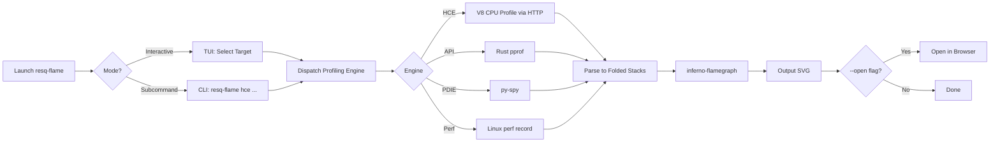

<!--
  Copyright 2026 ResQ

  Licensed under the Apache License, Version 2.0 (the "License");
  you may not use this file except in compliance with the License.
  You may obtain a copy of the License at

      http://www.apache.org/licenses/LICENSE-2.0

  Unless required by applicable law or agreed to in writing, software
  distributed under the License is distributed on an "AS IS" BASIS,
  WITHOUT WARRANTIES OR CONDITIONS OF ANY KIND, either express or implied.
  See the License for the specific language governing permissions and
  limitations under the License.
-->

# resq-flame

[](https://crates.io/crates/resq-flame)
[](LICENSE)

Interactive CPU profiler and SVG flame graph generator for ResQ services. Provides a TUI for selecting profiling targets and a subcommand interface for scripted profiling, piping output through `inferno-flamegraph`.

## Overview

`resq-flame` supports multiple profiling backends (V8 CPU profiles, pprof, py-spy, Linux perf) and converts their output into the folded-stack format consumed by `inferno`. The result is an interactive SVG flame graph you can open in any browser.

## Profiling Pipeline



## Installation

```bash
# From the workspace root
cargo build --release -p resq-flame

# Binary location
target/release/resq-flame
```

### Prerequisites

| Tool | Required For | Install |
|------|-------------|---------|
| `inferno` | All SVG generation | `cargo install inferno` |
| `py-spy` | Python (PDIE) profiling | `pip install py-spy` |
| `perf` | Linux kernel profiling | `sudo apt install linux-perf` or `sudo pacman -S perf` |

## CLI Arguments

### Global Flags

| Flag | Short | Default | Description |
|------|-------|---------|-------------|
| `--output <path>` | `-o` | `flamegraph.svg` | Output SVG file path |
| `--open` | | `false` | Open the SVG in the default browser after generation |

### Subcommand: `hce`

Fetch a V8 CPU profile from the Coordination HCE server.

| Flag | Short | Default | Description |
|------|-------|---------|-------------|
| `--url <url>` | `-u` | `http://localhost:5000` | HCE server URL |
| `--duration <ms>` | `-d` | `5000` | Profile duration in milliseconds |

## Usage Examples

### Interactive TUI (default)

```bash
# Launch the target selection TUI
resq-flame
```

Use arrow keys or `j`/`k` to navigate, `Enter` to start profiling the selected target, and `q` or `Esc` to quit.

### Subcommand Mode

```bash
# Profile the HCE service for 5 seconds
resq-flame hce

# Profile with custom URL and duration, output to custom path
resq-flame hce --url http://staging:5000 --duration 10000 --output hce-profile.svg

# Profile and auto-open in browser
resq-flame --open hce --duration 3000
```

## Profiling Targets (TUI)

| Target | Engine | Description |
|--------|--------|-------------|
| Coordination HCE | `hce` | Node.js/Bun service via HTTP metrics |
| Infrastructure API | `api` | Rust backend via pprof |
| Intelligence PDIE | `python` | Python AI engine via py-spy |
| Linux Perf | `perf` | System-wide profiling via `perf record` |

## TUI Keybindings

| Key | Action |
|-----|--------|
| `q` / `Esc` | Quit |
| `Enter` | Profile the selected target |
| `Up` / `k` | Move selection up |
| `Down` / `j` | Move selection down |

## Environment Variables

| Variable | Description |
|----------|-------------|
| `RESQ_TOKEN` | Bearer token for HCE authentication |
| `RESQ_API_KEY` | API key for infrastructure-api and PDIE |

## Output Format

The tool generates interactive SVG flame graphs using the `inferno` crate:

- **Folded stacks** are the intermediate format (`frame1;frame2;frameN count`).
- **SVG output** supports interactive features when opened in a browser: click to zoom, `Ctrl+F` to search.

### Input Format Support

| Format | Function | Description |
|--------|----------|-------------|
| V8 `.cpuprofile` | `cpuprofile_to_folded` | Chrome/Node.js CPU profiles with tree structure |
| bpftrace histogram | `parse_bpftrace_output` | `frame1, frame2: count` lines |
| Pre-folded stacks | `parse_folded_stacks` | Standard `stack count` lines |

### Reading Flame Graphs

- **Width** of a frame = proportion of total samples where that function was on the stack
- **Height** = call depth (bottom is root, top is leaf)
- **Wide frames at the top** = hot leaf functions (primary optimization targets)
- **Wide frames in the middle** = called frequently from many paths

## Safety Notes

- Profiling is **read-only** -- it does not modify the target service.
- External profiler binaries (`py-spy`, `perf`) are invoked as subprocesses; the tool handles missing binaries gracefully.
- Use reasonable durations when profiling production environments to minimize overhead.
- The HCE subcommand connects via HTTP and does not require kernel-level access.
- `perf` mode requires appropriate Linux capabilities (`CAP_SYS_ADMIN` or `perf_event_paranoid` settings).

## Typical Workflow

```bash
# 1. Start the target service
cargo run --manifest-path services/infrastructure-api/Cargo.toml

# 2. Generate load
cd services/simulation-harness && dotnet run

# 3. Profile while load is running
resq-flame --output before.svg hce --duration 30000

# 4. Make optimizations, restart, re-profile
resq-flame --output after.svg hce --duration 30000

# 5. Compare the two flame graphs visually
```

## License

Licensed under the Apache License, Version 2.0. See [LICENSE](../../LICENSE) for details.
