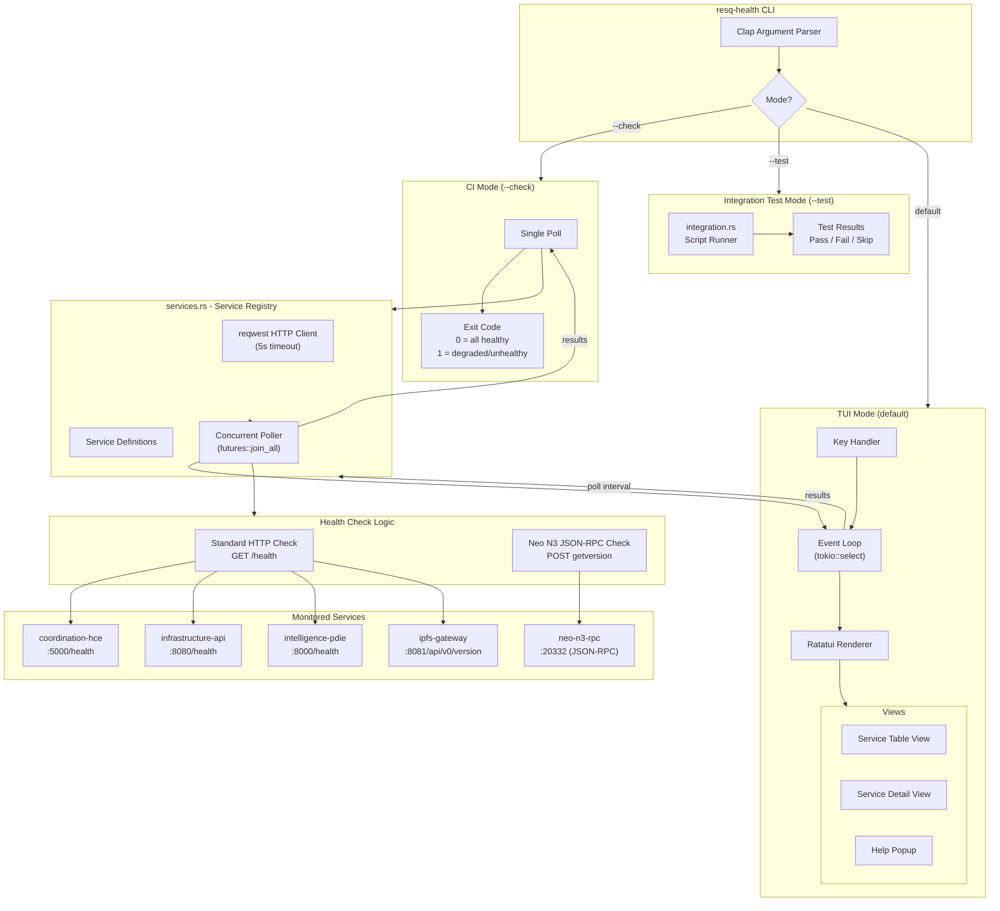

<!--
  Copyright 2026 ResQ

  Licensed under the Apache License, Version 2.0 (the "License");
  you may not use this file except in compliance with the License.
  You may obtain a copy of the License at

      http://www.apache.org/licenses/LICENSE-2.0

  Unless required by applicable law or agreed to in writing, software
  distributed under the License is distributed on an "AS IS" BASIS,
  WITHOUT WARRANTIES OR CONDITIONS OF ANY KIND, either express or implied.
  See the License for the specific language governing permissions and
  limitations under the License.
-->

# resq-health

[](https://crates.io/crates/resq-health)
[](LICENSE)

Service health monitoring dashboard for the ResQ platform. Polls all service health endpoints concurrently and displays live status with latency in a Ratatui TUI. Also serves as a CI health gate via `--check` mode, and supports integration test execution via `--test`.

## Overview

`resq-health` monitors five core ResQ services by issuing HTTP health checks on a configurable interval. Standard services are probed with `GET /health`, while the Neo N3 RPC node uses a JSON-RPC `getversion` call. Results are displayed in a navigable table with color-coded status indicators, latency measurements, and error diagnostics. A non-interactive `--check` mode provides deterministic exit codes for CI pipelines.

## Architecture



## Installation

```bash
# From the workspace root
cargo install --path crates/resq-health

# Or build locally
cargo build --release -p resq-health
# Binary: target/release/resq-health
```

## CLI Arguments

| Flag | Short | Default | Description |
|------|-------|---------|-------------|
| `--check` | `-c` | off | CI mode: run a single health check cycle, print results, and exit with a status code |
| `--interval <N>` | `-i` | `5` | Polling interval in seconds (TUI mode only) |
| `--test <PATH>` | `-t` | -- | Path to an integration test script or directory to execute |

## Usage Examples

### Interactive TUI (default)

```bash
# Launch the health dashboard with default 5-second polling
resq-health

# Increase polling interval to 10 seconds
resq-health --interval 10

# Short form
resq-health -i 10
```

### CI / Health Gate Mode

```bash
# Single check, exits with status code
resq-health --check

# Use as a deployment gate
resq-health --check || { echo "Services not ready"; exit 1; }

# Combine with deploy
resq-deploy --env dev --action up
resq-health --check
```

### Integration Tests

```bash
# Run integration test scripts
resq-health --test tests/smoke.sh

# Run tests from a directory
resq-health --test tests/integration/
```

### Integration Test JSON Format

```json
[
  {
    "name": "infrastructure-api health",
    "method": "GET",
    "url": "http://localhost:5000/health",
    "expect_status": 200
  },
  {
    "name": "create incident",
    "method": "POST",
    "url": "http://localhost:5000/incidents",
    "body": { "incident_type": "FLOOD", "severity": "HIGH" },
    "expect_status": 201
  }
]
```

## TUI Layout

```
+-----------------------------------------------------+
|  ResQ Health Monitor          Up: 42s                |
|  3/5 SERVICES HEALTHY                                |
+-----------------------------------------------------+
|  SERVICE              STATUS      LATENCY  MESSAGE   |
|                                                      |
|  infrastructure-api   Healthy     45ms     -         |
|  coordination-hce     Healthy     23ms     -         |
|  intelligence-pdie    Degraded    1250ms   -         |
|  neo-n3-rpc           Healthy     89ms     -         |
|  web-dashboard        Unhealthy   5000ms   Timeout   |
+-----------------------------------------------------+
|  [Q] Quit   [Up/Down] Nav   [Enter] Details          |
+-----------------------------------------------------+
```

### Detail View

Pressing `Enter` on a service shows an expanded detail panel with the full URL, status, latency, and diagnostic error message.

## Keyboard Shortcuts

| Key | Action |
|-----|--------|
| `q` / `Esc` | Quit the application |
| `Down` / `j` | Move selection down |
| `Up` / `k` | Move selection up |
| `Enter` | Toggle detail view for selected service |
| `h` | Toggle help popup |

## Health Status Levels

| Status | Color | Description |
|--------|-------|-------------|
| `Healthy` | Green | Service responded successfully within timeout |
| `Degraded` | Yellow | Service responded but reported non-"ok" status or high latency |
| `Unhealthy` | Red | Service timed out, returned an error HTTP status, or is unreachable |
| `Unknown` | Gray | Service has not been checked yet (initial state) |

## Exit Codes (--check mode)

| Exit Code | Meaning |
|-----------|---------|
| `0` | All services report Healthy |
| `1` | One or more services are not Healthy |

## Monitored Services

| Service | Default URL | Health Endpoint | Protocol |
|---------|-------------|-----------------|----------|
| `coordination-hce` | `http://localhost:5000` | `/health` | HTTP GET |
| `infrastructure-api` | `http://localhost:8080` | `/health` | HTTP GET |
| `intelligence-pdie` | `http://localhost:8000` | `/health` | HTTP GET |
| `neo-n3-rpc` | `http://localhost:20332` | `/` | JSON-RPC POST (`getversion`) |
| `ipfs-gateway` | `http://localhost:8081` | `/api/v0/version` | HTTP GET |

All requests use a 5-second timeout. Services that do not respond within the timeout are marked **Unhealthy**.

## Environment Variables

Service URLs can be overridden via environment variables:

| Variable | Default | Description |
|----------|---------|-------------|
| `HCE_URL` | `http://localhost:5000` | Base URL for the coordination-hce service |
| `INFRA_API_URL` | `http://localhost:8080` | Base URL for the infrastructure-api service |
| `PDIE_URL` | `http://localhost:8000` | Base URL for the intelligence-pdie service |
| `NEO_RPC_URL` | `http://localhost:20332` | URL for the Neo N3 RPC node |
| `IPFS_URL` | `http://localhost:8081` | Base URL for the IPFS gateway |

```bash
# Example: point at a remote staging cluster
HCE_URL=http://staging.internal:5000 \
INFRA_API_URL=http://staging.internal:8080 \
resq-health --check
```

## Configuration

`resq-health` does not use configuration files. All configuration is handled through CLI flags and environment variables as described above. To add a new service to the monitoring list, add it to the `ServiceRegistry::new()` function in `src/services.rs`.

## Dependencies

| Crate | Purpose |
|-------|---------|
| `resq-tui` | Shared TUI components, theme, header/footer/popup widgets |
| `clap` | CLI argument parsing (derive mode) |
| `tokio` | Async runtime with timer support |
| `reqwest` | HTTP client for health check requests |
| `futures` | Concurrent polling via `join_all` |
| `serde` / `serde_json` | JSON deserialization of health responses |
| `chrono` | Timestamp handling |
| `walkdir` | Directory traversal for integration test discovery |
| `anyhow` | Error propagation |

## License

Licensed under the Apache License, Version 2.0. See [LICENSE](../../LICENSE) for details.
