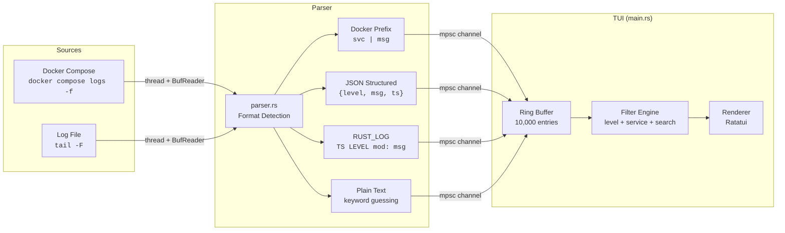

<!--
  Copyright 2026 ResQ

  Licensed under the Apache License, Version 2.0 (the "License");
  you may not use this file except in compliance with the License.
  You may obtain a copy of the License at

      http://www.apache.org/licenses/LICENSE-2.0

  Unless required by applicable law or agreed to in writing, software
  distributed under the License is distributed on an "AS IS" BASIS,
  WITHOUT WARRANTIES OR CONDITIONS OF ANY KIND, either express or implied.
  See the License for the specific language governing permissions and
  limitations under the License.
-->

# resq-logs

[](https://crates.io/crates/resq-logs)
[](LICENSE)

Multi-source log aggregator and real-time stream viewer for ResQ services. Streams logs from Docker Compose containers or local files into a searchable, filterable Ratatui TUI with a 10,000-line ring buffer, color-coded log levels, and deterministic per-service coloring.

## Architecture



## Installation

```bash
# From workspace root
cargo build --release -p resq-logs

# Binary location
target/release/resq-logs
```

## CLI Arguments

| Flag | Type | Default | Description |
|------|------|---------|-------------|
| `--source <src>` | `String` | `docker` | Log source: `docker` or `file` |
| `--path <path>` | `String` | `.` | File or directory path (required when `--source file`) |
| `--service <name>` | `String` | all | Filter to a specific Docker service name |
| `--level <level>` | `String` | all | Initial minimum log level: `error`, `warn`, `info`, `debug`, `trace` |

## Usage Examples

```bash
# Stream all Docker Compose service logs (default)
resq-logs

# Stream logs from a specific service only
resq-logs --source docker --service infrastructure-api

# Tail a local log file
resq-logs --source file --path services/infrastructure-api/logs/api.log

# Start with error-level filter active
resq-logs --source docker --level error

# Combine service and level filters
resq-logs --source docker --service coord-hce --level warn
```

## Log Format Support

The parser (`parser.rs`) attempts each format in order and uses the first successful match:

| Priority | Format | Example | Fields Extracted |
|----------|--------|---------|-----------------|
| 1 | Docker Compose prefix | `resq-api \| Server started` | service, message |
| 2 | JSON structured | `{"level":"error","msg":"timeout","ts":"2026-01-01T00:00:00Z"}` | level, message, timestamp, service |
| 3 | RUST_LOG | `2026-01-01T00:00:00Z INFO module::path: message` | timestamp, level, service (module), message |
| 4 | Plain text fallback | `Something happened with an ERROR` | message, level (keyword guess) |

### JSON Field Aliases

The JSON parser accepts multiple field names for interoperability:

| Canonical | Aliases |
|-----------|---------|
| `level` | `lvl`, `severity` |
| `msg` | `message` |
| `timestamp` | `time`, `ts`, `@timestamp` |
| `service` | `component` |

### Level Recognition

The parser recognizes these level keywords (case-insensitive):

| Level | Recognized Keywords |
|-------|-------------------|
| ERROR | `error`, `err`, `fatal`, `critical`, `panic` |
| WARN | `warn`, `warning` |
| INFO | `info` |
| DEBUG | `debug`, `dbg` |
| TRACE | `trace` |

## Log Sources

### Docker (`--source docker`)

Runs `docker compose logs -f --no-color --tail 200` from the `infra/docker/` directory relative to the project root. A background thread reads stdout line-by-line through a `BufReader` and sends parsed entries over an unbounded `mpsc` channel.

- Requires a running Docker Compose stack
- Strips `resq-` prefix from container names automatically
- Optional `--service` flag passes the service name to Docker for server-side filtering

### File (`--source file`)

Opens and reads a local log file to completion, parsing each line. A background thread handles the I/O.

```bash
resq-logs --source file --path /var/log/resq/infrastructure-api.log
```

## Keybindings

| Key | Mode | Action |
|-----|------|--------|
| `q` | Normal | Quit |
| `Esc` | Normal | Quit |
| `/` | Normal | Enter search mode |
| `Enter` | Search | Apply search query and return to normal mode |
| `Esc` | Search | Cancel search and return to normal mode |
| `Backspace` | Search | Delete last character |
| `f` | Normal | Cycle level filter: All > Error > Warn > Info > Debug > Trace > All |
| `c` | Normal | Clear all buffered log lines |
| `g` | Normal | Jump to bottom and enable follow (auto-scroll) mode |
| `Up` | Normal | Scroll up one line (disables auto-scroll) |
| `Down` | Normal | Scroll down one line (re-enables auto-scroll at bottom) |
| `PageUp` | Normal | Scroll up 20 lines |
| `PageDown` | Normal | Scroll down 20 lines |

## TUI Layout

```
+-- Log-Explorer ---------- STATUS_LINE ----------------------+
|                                                              |
|  HH:MM:SS LEVEL  SERVICE_NAME  message text...              |
|  HH:MM:SS LEVEL  SERVICE_NAME  message text...              |
|  ...                                                         |
|                                                              |
|  +-- SEARCH popup (when / is pressed) ---+                   |
|  | > search_query_here                   |                   |
|  +---------------------------------------+                   |
|                                                              |
+--------------------------------------------------------------+
| Q Quit  / Search  F Filter  C Clear  G Follow  Up/Down Scroll|
+--------------------------------------------------------------+
```

## Configuration

### Buffer Size

The ring buffer holds a maximum of **10,000** log entries (`MAX_LOG_LINES`). When full, the oldest entry is dropped as each new entry arrives. Up to **256** entries are ingested per render frame (`MAX_INGEST_PER_FRAME`) to prevent UI stalls during high-throughput bursts.

### Project Root Detection

The Docker source resolves the project root by navigating two levels up from the current working directory (`ancestors().nth(2)`). The compose file is expected at `<project_root>/infra/docker/docker-compose.yml`.

## Environment Variables

This tool does not currently read environment variables for configuration. All settings are passed via CLI flags.

## Related Tools

- [`resq-perf`](../resq-perf/README.md) -- Real-time performance monitoring dashboard
- [`resq-health`](../resq-health/README.md) -- Service health checker
- [`resq-flame`](../resq-flame/README.md) -- CPU flame graph profiler

## License

Licensed under the Apache License, Version 2.0. See [LICENSE](../../LICENSE) for details.
